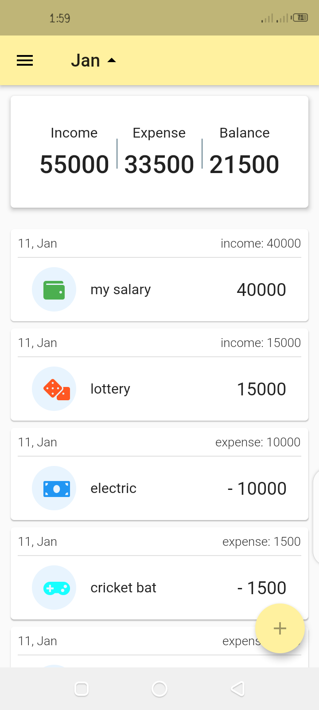
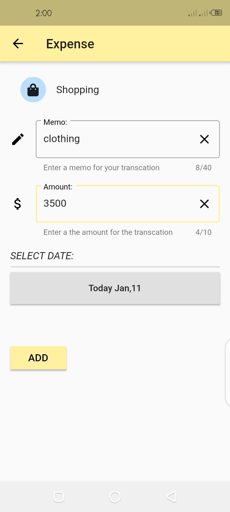

     <h1>Home Budget planner flutter app</h1>
      
     <h2> Download apk file </h2>
<h1><a href="https://drive.google.com/file/d/1KAWC6Qxf9GZN9yXOLiTPzyIyd2OprjWh/view?usp=sharing">Click here</a></h1>  
       <h2> -- Splash screen -- </h2> 
        
       
        
      
 <h3> -- ScreenShots -- </h3> 
 

 
 
 
 
 
 
 
 
 
 
 

 

 
